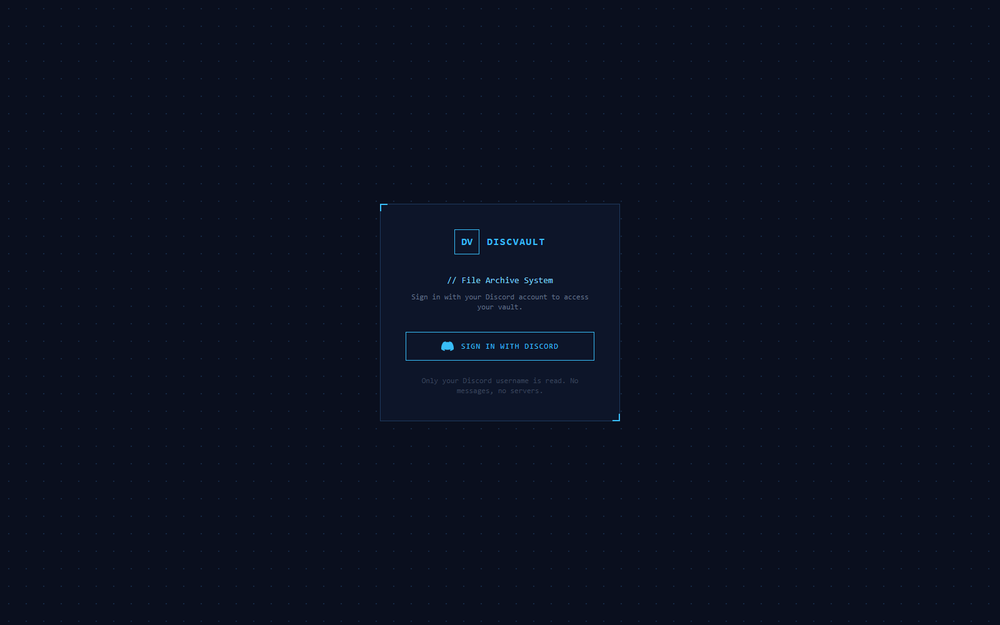
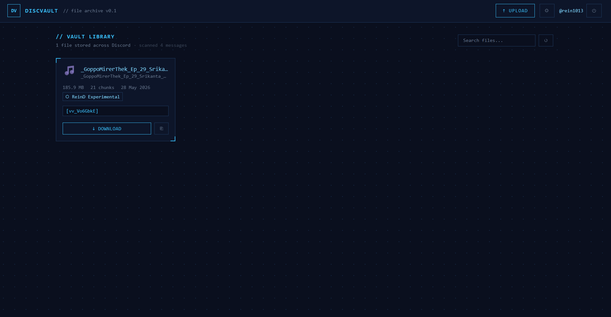
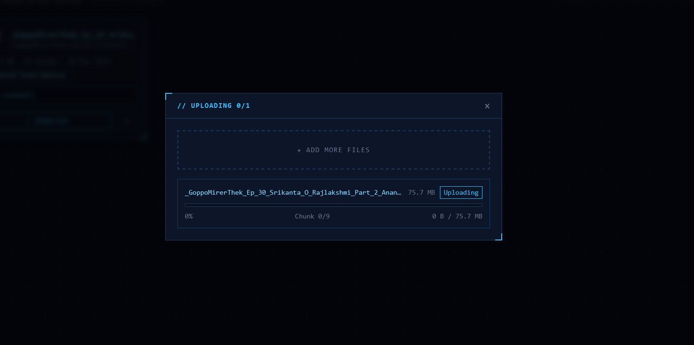
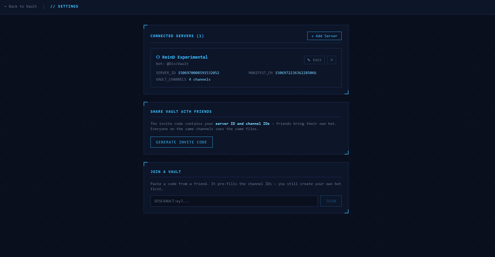

# DiscVault

Free, unlimited large-file storage built on top of Discord's own attachment limits. Files (2GB–30GB videos, in practice) are streamed, split into chunks under Discord's per-message attachment cap, and uploaded as messages across a private server — nothing is stored anywhere else. A manifest tracks where every chunk landed so the file can be rebuilt and integrity-checked (SHA-256) on download. Controlled from CLI, a web dashboard, and (planned) desktop/Android clients.

**Live:** [discvault.onrender.com](https://discvault.onrender.com)

## How it works

- **Chunking** — a file is streamed (never fully loaded into memory) and split into pieces sized to fit under Discord's free-tier attachment limit
- **Upload** — chunks are pushed to Discord as message attachments, parallelized without tripping rate limits, and resumable if an upload fails mid-way
- **Manifest** — a per-file record of every chunk's location (server, channel, message) is what makes reassembly possible
- **Integrity** — SHA-256 hashing verifies the rebuilt file matches the original, byte for byte
- **Sharing** — an invite code carries your server and channel IDs; a friend brings their own bot and everyone on the same channels sees the same files, no bot-token sharing

See [`docs/TECHNICAL_OVERVIEW.md`](./docs/TECHNICAL_OVERVIEW.md) for the full design rationale and protocol details.

## Screenshots

| Sign in | Vault library |
|---|---|
|  |  |

| Chunked upload | Server settings, sharing |
|---|---|
|  |  |

## Stack

| Layer | Technology |
|---|---|
| Core | `packages/core` — chunker, SHA-256 hashing, manifest schema, rebuilder (shared logic, TypeScript) |
| Discord I/O | `packages/discord-adapter` — REST client for chunk upload/download |
| CLI | `apps/cli` — `discvault upload` / `download` / `list` |
| Web | `apps/web` — Next.js dashboard + API, Discord OAuth |
| Deployment | Render.com |

## Repo layout

```
packages/
  core/               chunker, hashing, manifest, rebuilder
  discord-adapter/    Discord REST client
apps/
  cli/                discvault upload / download / list
  web/                Next.js dashboard + API backend
docs/                 technical writeups
render.yaml           Render deployment config
```
